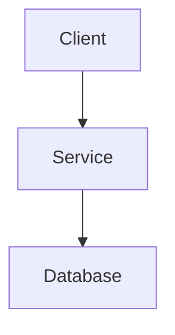

# Article Title

## Executive Summary

## Problem Statement

## Why It Matters

## Real-World Scenario

## Core Concepts

## Architecture Diagram

## Code Example

## Performance Considerations

## Best Practices

## Common Mistakes

## Interview Questions

## References
